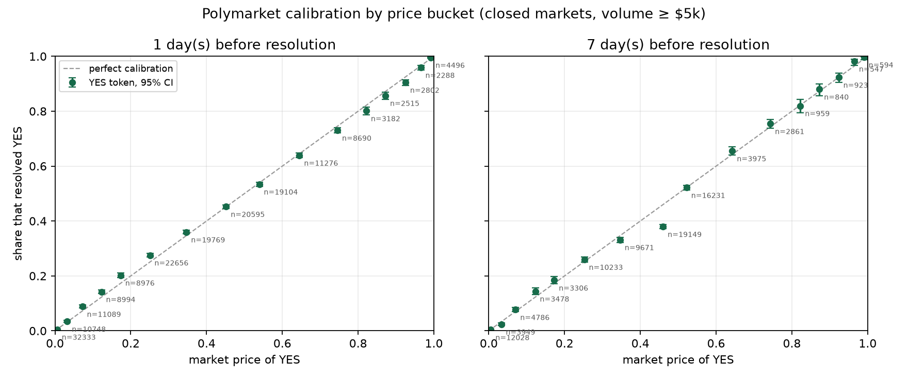
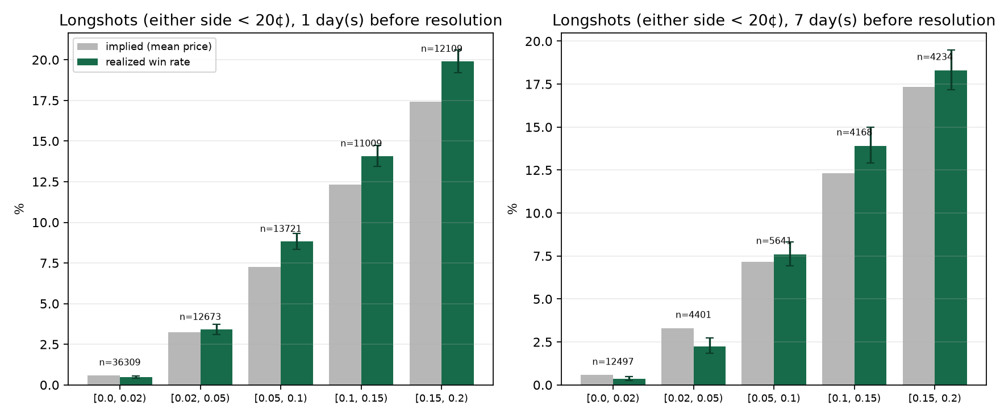
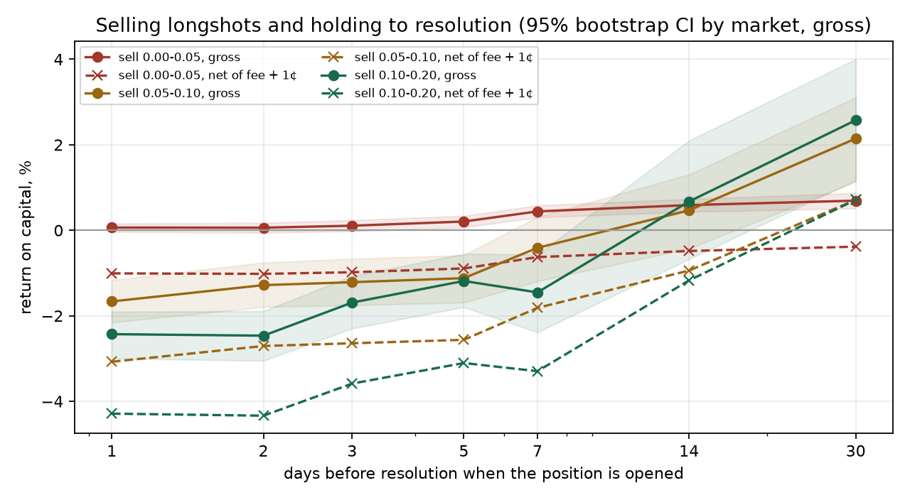
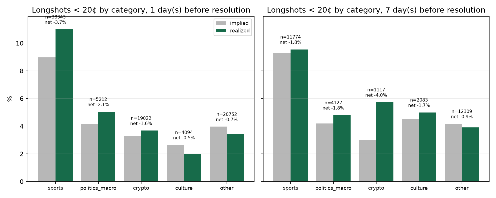

# Lab 1 · Are longshots overpriced on Polymarket, and can you sell them?

*PredictionLab, September 2026. Weekly digests (Russian) in the Telegram channel [@predictionlab_ru](https://t.me/predictionlab_ru). Scripts, data window and figures are in this folder; every number below comes from `results.json`, `results_fills_20c.json` and `results_fills_10c.json`, produced by `run.py`.*

**Short answer.** Within a week of the event, no: outcomes priced 5–20¢ on Polymarket win *more* often than their price implies, so selling them loses before costs. The textbook overpricing exists only in the sub-2¢ tail and in longshots priced a month or more out, and there it is worth 0.4–1.7¢ per share: less than a taker's spread, enough for a maker to think about, not enough for a business.

<!-- auto:datawindow -->
*Data refreshes nightly: as of 2026-09-19 10:14 UTC there are 183,992 markets with observations and 770,575 observations. The tables below are recomputed on that data; the prose was written on 2026-09-18 (182,503 markets) and is revised by hand when a headline number changes sign.*
<!-- /auto:datawindow -->

## The question

The favorite–longshot bias is the best-known regularity in betting markets: cheap outcomes win less often than their price implies, so selling them should pay. Kalshi data (Bürgi, Deng and Whelan, 2025) shows sub-10¢ contracts losing more than 60% of stake. A Polymarket paper released a week before this lab (Cardozo and Rivero-Wildemauwe, arXiv 2609.12878) finds the classic bias at the contract level, sub-10¢ buys losing 19.3¢ per dollar, but reports the sign flipping to +4.1¢ once contracts are grouped by event, in crypto and politics though not in sports.

We asked three narrower questions with public data anyone can re-pull:

1. At a fixed number of days before the event, how often do outcomes priced under 20¢ actually win?
2. What does a taker who systematically sells those longshots and holds to resolution earn, after Polymarket's 2026 fees and a spread haircut?
3. Does the answer survive splitting by category, horizon, volume, market lifetime and month?

## Data

**Public history.** All closed Polymarket markets whose `endDate` falls between 2025-09-01 and 2026-09-17 with lifetime volume of at least $5,000: 492,717 markets pulled from the Gamma API, 490,677 of which resolved cleanly to 0/1. For each market that lived at least 1.5 days we pulled the daily price history of the YES token from the CLOB API (the CLOB keeps only daily points for closed markets, so intraday horizons are not available). 234,069 markets had two or more daily points, and 182,503 had at least one usable pre-event price; those give 764,802 (market, horizon) observations. Sports is 67% of the markets, crypto 12%, politics and macro 4%, culture 3%, the rest unclassified.

**Event time.** "Days before the event" is measured from when the uncertainty actually ends, not from when Polymarket booked the resolution, which for sports can be days after the game:

- sports (140,731 markets): `gameStartTime`;
- questions of the form "by May 31, 2026" (971): that deadline;
- everything else: the earlier of `endDate` (76,568) and `closedTime` (15,799).

Prices observed before the market started trading, the 0.50 placeholder that exists before the first trade, and opening quotes near 0.50 that never moved are dropped.

**Sides.** Each market contributes its YES price *p* and its NO price *1 − p*. A "longshot" is any side priced below 20¢ at the horizon. A market contributes at most one longshot side per horizon, so nothing is double counted.

**Fees.** Since 2026 Polymarket charges takers `rate × p × (1 − p)` per share, with category rates of 0.05 for sports, 0.07 for crypto, 0.04 for politics and finance and 0.05 elsewhere (docs.polymarket.com/trading/fees, July 2026 schedule). Makers pay nothing. "Net" below means taker fee plus a flat 1¢ per share for crossing the spread; "gross" is what a maker filled at mid would keep. `results.json` also carries the fee-only figure and the breakeven haircut per share.

**Own fill stream.** As a second, independent view we used 1.94 million taker fills captured by our own scanner from Polymarket's data API between 2026-05-03 and 2026-05-29, restricted to fills below 20¢ (210,187 fills on 1,434 markets), with resolutions pulled per market from the CLOB.

## Results

### 1. The market is well calibrated, except where the textbook says the money is



One day before the event, YES prices below 5¢ are calibrated to within a tenth of a point: sub-2¢ outcomes (n = 31,825) resolve YES 0.47% of the time at a mean price of 0.57%; 2–5¢ outcomes resolve 3.31% of the time at 3.24%. From 5¢ to 30¢ the market *under*prices outcomes: 7.2¢ outcomes win 8.7% of the time, 12¢ outcomes win 14.0%, 17¢ outcomes win 20.0%, 25¢ outcomes win 27.5%. The mirror image sits at the top: 82¢ favorites win 80.3%, 92.5¢ favorites win 90.8%. Wilson intervals on these buckets are under a point wide.

### 2. Longshots one to seven days out are fair to cheap, not expensive



Pooling both sides, at the 1-day horizon:

<!-- auto:table_h1_bands -->
| Side priced | n | implied | realized | sell gross | sell after fee | sell after fee + 1¢ |
|---|---|---|---|---|---|---|
| under 5¢ | 48,844 | 1.28% | 1.22% | +0.06% [-0.04, +0.16] | -0.01% | -1.01% |
| 5–10¢ | 13,607 | 7.25% | 8.80% | -1.66% [-2.15, -1.17] | -2.03% | -3.07% |
| 10–20¢ | 22,930 | 14.99% | 17.06% | -2.43% [-3.00, -1.90] | -3.17% | -4.29% |
| all under 20¢ | 85,381 | 5.92% | 6.68% | -0.81% [-0.98, -0.64] | -1.10% | -2.13% |
<!-- /auto:table_h1_bands -->
Returns are per dollar of capital for buying the complement and holding to resolution; brackets are 95% bootstrap intervals resampled by market. At 7 days the picture is the same with wider intervals: under 5¢ +0.44% gross [+0.29, +0.58], 5–10¢ −0.42% [−1.12, +0.32], 10–20¢ −1.37% [−2.28, −0.46]. A taker selling longshots in the week before an event loses money in every band once fees and a 1¢ spread are paid.

### 3. The classic bias exists a month out, and it is worth about a cent



<!-- auto:table_horizons -->
| Days before event | under 5¢: gross / net | 5–10¢: gross / net | 10–20¢: gross / net |
|---|---|---|---|
| 1 | +0.06% / -1.01% (n=48,844) | -1.66% / -3.07% (n=13,607) | -2.43% / -4.29% (n=22,930) |
| 2 | +0.06% / -1.02% (n=39,938) | -1.28% / -2.71% (n=12,213) | -2.46% / -4.34% (n=20,449) |
| 3 | +0.11% / -0.98% (n=34,629) | -1.21% / -2.64% (n=11,262) | -1.69% / -3.59% (n=18,971) |
| 5 | +0.21% / -0.89% (n=27,925) | -1.12% / -2.56% (n=10,485) | -1.19% / -3.10% (n=16,625) |
| 7 | +0.44% / -0.63% (n=16,882) | -0.41% / -1.81% (n=5,580) | -1.45% / -3.30% (n=8,319) |
| 14 | +0.59% / -0.48% (n=12,939) | +0.47% / -0.94% (n=3,471) | +0.67% / -1.17% (n=3,439) |
| 30 | +0.69% / -0.38% (n=8,241) | +2.14% / +0.71% (n=2,205) | +2.57% / +0.71% (n=2,602) |
<!-- /auto:table_horizons -->

The further from the event, the more the textbook holds. Selling sub-5¢ longshots grosses +0.07% at 1 day, +0.44% at 7 days, +0.59% at 14 days and +0.69% at 30 days. Thirty days out the 5–10¢ band is priced at 7.07% and wins 5.09% (gross +2.13% [+1.14, +3.12]); the 10–20¢ band is priced at 14.08% and wins 11.81% (gross +2.65% [+1.17, +4.06]). After the taker fee and a 1¢ haircut those become +0.70% [−0.23, +1.66] and +0.79% [−0.61, +2.22] per position, with the capital locked for a month. The breakeven haircut is 0.6¢ per share under 5¢ and 1.7¢ in the 5–20¢ bands, so the edge survives a maker's costs and roughly one tick of a taker's.

Note that the horizon effect is partly composition: only long-lived markets exist 30 days out, and they are mostly politics, crypto deadlines and "other", not games.

### 4. Where the overpricing lives: thin, long-lived, non-sports markets



At the 1-day horizon:

<!-- auto:table_h1_cuts -->
| Cut | implied | realized | sell gross |
|---|---|---|---|
| sports (n = 36,932) | 8.96% | 10.78% | -2.01% [-2.34, -1.68] |
| politics and macro (n = 5,043) | 4.12% | 5.14% | -1.06% [-1.69, -0.43] |
| crypto (n = 18,763) | 3.28% | 3.64% | -0.37% [-0.64, -0.12] |
| culture (n = 4,080) | 2.64% | 2.01% | +0.65% [+0.21, +1.06] |
| other (n = 20,563) | 3.95% | 3.39% | +0.58% [+0.33, +0.82] |
| lowest volume tercile | 6.28% | 5.78% | +0.53% [+0.24, +0.82] |
| highest volume tercile | 5.40% | 7.33% | -2.04% [-2.35, -1.75] |
| market lifetime over 60 days | 1.97% | 1.35% | +0.64% [+0.40, +0.87] |
| market lifetime 3–14 days | 6.57% | 7.68% | -1.18% [-1.43, -0.94] |
| binary market | 6.74% | 8.46% | -1.85% [-2.13, -1.56] |
| negative-risk group member | 5.27% | 5.27% | -0.00% [-0.20, +0.20] |
<!-- /auto:table_h1_cuts -->
The pattern is consistent: overpriced longshots are a thin-market, long-horizon phenomenon. Liquid sports markets run the other way, and so do politics and crypto at short horizons. Removing the 15,799 markets whose event time had to be taken from `closedTime` (the cut most exposed to look-ahead) leaves the sub-5¢ result unchanged: +0.12% gross at 1 day, +0.64% at 7 days.

### 5. Over time

The reverse bias got stronger through 2026. Selling all sub-20¢ longshots one day out grossed +0.87% in November 2025 and +0.80% in December, then −0.68% in January 2026, −0.98% in May, −1.83% in July, −4.22% in August and −3.55% in September. August and September are football season and the months where the Gamma pagination cap truncated eleven busy days, so the late-2026 figures carry both a composition shift and a coverage caveat. Whatever the cause, "sell longshots" has not been a stable rule on Polymarket at any point in the window.

## The fill-stream check

The May 2026 fill stream tells the same story from a different angle, and it shows how much the *aggregation* decides the headline.

| View | n | implied | realized |
|------|---|---------|----------|
| Every fill below 20¢ counts once | 210,187 fills | 12.6% | 13.3% |
| Weighted by notional | same | 14.0% | 15.1% |
| One observation per (market, outcome), at the first fill below 20¢ in the window | 1,617 | 16.3% | 20.6% |
| Same, sports only | 1,429 | 16.7% | 21.5% |
| Same, non-sports | 188 | 13.3% | 13.8% |
| Below 10¢, first touch | 1,058 | 8.0% | 12.1% |

Buying $1 of every longshot at its first cheap fill would have returned +48% on average below 20¢ (bootstrap 95% CI +28% to +71%) and +80% below 10¢ (CI +44% to +121%). That is not a tradable strategy: it takes the first fill of a window that starts on an arbitrary date, so a longshot that was already rising when the window opened enters at a price that no longer reflects its odds, and many of these markets could not absorb $1 at that price. It is, however, a clean demonstration that fill-weighted and market-weighted views of the same month differ by seven points of win rate, which is the whole distance between "longshots are overpriced" and "longshots are cheap".

Two other details. Takers who *bought* longshots did marginally better than the price implied (realized 13.9% vs 12.9%); takers who sold them were exactly calibrated (11.8% vs 11.9%). And the sports/non-sports split at the fill level runs the other way from the first-touch view: fill-weighted, non-sports longshots won 8.4% of the time at an implied 12.1%, the textbook bias, while sports underdogs won 15.7% at an implied 12.9%.

## What we would trade on, and what we would not

**Not this: selling longshots as a taker in the week before an event.** Gross returns are negative in the 5–20¢ bands and zero under 5¢; net returns are −1% to −4% per position. The strategy in the registry as `fade_any` was frozen for a fat left tail; this lab says the expected value was not there either.

**Maybe, as one leg of a maker book: quoting against sub-5¢ longshots in thin, long-lived markets.** The edge is 0.4–0.7¢ per share, which a maker keeps and a taker pays away. Over a month of capital lock-up that is a low single-digit annualized return before tail risk, so it only makes sense inside a broader quoting strategy. That is lab 2.

**Worth a dedicated lab: sports underdogs at 5–20¢ inside a day of the game.** They won 10.8% at an implied 9.0%, and at 5–10¢ the gross buy return was +21% per dollar. After the sports taker fee (0.33¢ on a 7¢ share) and a 1¢ spread that is roughly +2% to +4% per position with an 89% loss rate per bet and a result that changed sign between quarters. It needs intraday prices and a fill model before anyone should size it.

**What this lab does not settle.** Whether the near-event underpricing is retail favorite-chasing, liquidity providers skewing quotes, or a 2026 artefact of the sports fee schedule. The month-by-month drift and the sports concentration are the first things to pull on.

## Caveats

- Daily price points only. A longshot that was 3¢ a day before the game may have been 8¢ an hour before; intraday calibration is a different study.
- Sports markets a week before the game are mostly untraded opening lines: 42–49¢ YES quotes on totals and spreads seven days out resolved YES only 38% of the time (n = 17,525). The 7-day sports figures inherit that staleness; the 1-day figures do not.
- Markets shorter than 1.5 days (250,568 of the 490,677 resolved, mostly single-game and daily crypto markets) are excluded by construction, and eleven busy days in August and September 2026 were truncated at 2,100 markets by the Gamma pagination cap. Coverage is otherwise complete for markets with volume of at least $5,000.
- Category labels come from `gameStartTime` and keyword rules on the question text; "other" is a mixed bag.
- Fees use the July 2026 schedule for the whole window; the schedule was lower before March 2026, so net returns for early-window markets are slightly understated.
- The 1¢ spread haircut is an assumption. Fee-only returns and breakeven haircuts are in `results.json` and `tables.md`.
- Bootstrap intervals resample markets, not events, so correlated outcomes inside one negative-risk group are treated as independent markets. The negative-risk split above is the check on that.
- The window is dominated by one year of a market that grew sixteenfold; nothing here is a statement about 2024 or about Kalshi.

## Reproduce

```bash
python3 -m venv .venv && source .venv/bin/activate
pip install -r requirements.txt -r requirements-labs.txt
# full backfill (~2.5 h: 493k markets, 297k histories) into data/labs/longshot/*.parquet
python3 labs/2026-09-18-longshot-fade/run.py --stage all --start 2025-09-01
# or start from the published store and only pull what is new
gh release download data-latest --repo 1DanWave2/predictionlab --dir data/labs/longshot --pattern '*.parquet'
python3 labs/2026-09-18-longshot-fade/run.py --stage all --since-days 7
# fill-stream check (needs the private fills database)
python3 labs/2026-09-18-longshot-fade/run.py --stage fills --max-price 0.20
```

Stages resume from the parquet store. `data-window.txt` records the window and counts of the run behind the figures in this folder; the GitHub Action `nightly-data` refreshes the store, `results.json`, `tables.md` and the figures every night, so the tables on this page drift from the prose above as new markets close. The prose is revised by hand when a headline number changes sign.
