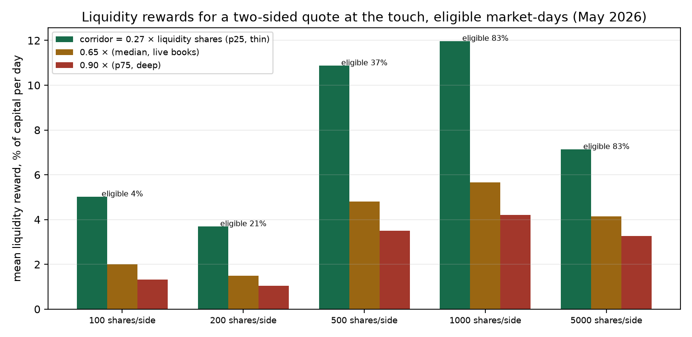
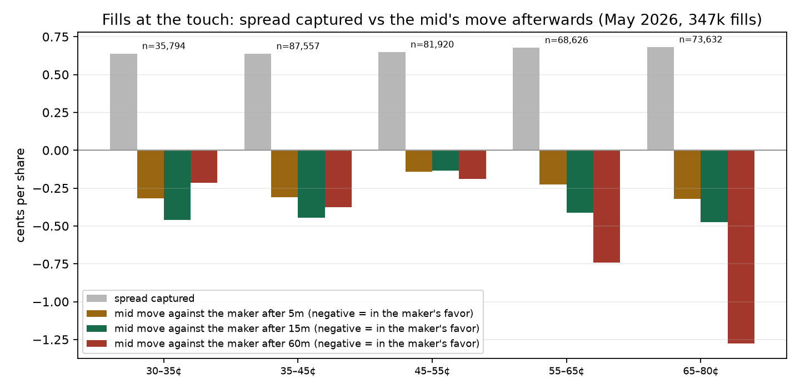
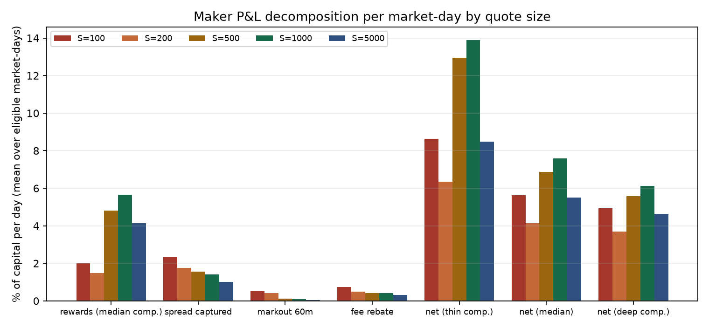

# Лаба 2 · Что реально зарабатывает пассивный мейкер на Polymarket

*PredictionLab, сентябрь 2026. Данные: наши собственные снапшоты стакана и тейкерские филы за май 2026 плюс живые стаканы CLOB, снятые 2026-09-19 для калибровки. Все цифры — из `results.json` (`extract.py` + `analyze.py`) и двух файлов калибровки в `data/labs/maker/`. Английская версия: README.md.*

**Коротко.** В мае 2026 программа liquidity rewards была всей игрой: на 819 наградных рынках, которые мы наблюдали, Polymarket платил около 0.9% в день от всего капитала, стоящего в коридоре наград (медианный рынок 1.0%), тогда как спред, который мейкер забирал на лучшей цене, стоил примерно 0.7¢ на акцию, а мид после фила в среднем двигался *в пользу* мейкера. Двусторонняя котировка по 1 000 акций на сторону на лучших ценах даёт по модели 2.4% капитала в день (медианный рынко-день) при медианной конкуренции, почти целиком из наград. Между этим числом и счётом в банке три вещи: для участия на большинстве рынков нужно 1 000 акций на сторону (счёт в $100 не допущен на 96% из них), оценка конкуренции неточна в два раза, и программа с тех пор сжалась: на живых рынках сегодня то же отношение пула к ликвидности — 0.25% в день, четверть от майского.

## Зачем эта лаба

Лаба 1 закончилась выводом «эдж в лонгшотах — мейкерский, около цента». Наши собственные paper-эксперименты с мейкером в мае убил размер счёта, а не рынок: на $100 один встречный фил съедал недели наград, а пороги eligibility не выполнялись ни разу. На данных никто не мерил, что заработал бы мейкер в середине шкалы. Эта лаба меряет, разделяя две части дохода: что программа платит за стоящие ордера и чего стоят сами филы после того, как мид сдвинулся.

## Данные

**Снапшоты стакана.** 479 334 снапшота 902 рынков Polymarket с 2026-05-07 по 2026-05-29, снятые нашим сканером каждые 33 секунды (медиана) на рынках, за которыми он следил: лучшие bid и ask, размер на лучшей цене, суммарный размер, параметры наград рынка по Gamma на тот момент (дневной пул, минимальный размер ордера, максимальный спред, показатель `liquidity`). Сканер смотрел только рынки по 30–80¢; про хвосты здесь ничего нет. У 819 из 902 рынков был активный пул.

**Тейкерские филы.** 1 943 590 филов из Data API Polymarket за те же недели; 1 165 152 из них на этих 902 рынках. Фил попадает в исследование markout, только если есть снапшот не старше 90 с и цена фила стоит на лучшей цене этого снапшота (в пределах тика, на стороне тейкера): выживает 347 529 филов на 697 рынках, $52.7M оборота.

**Живая калибровка.** Снапшоты хранят глубину на лучшей цене, но не всю лестницу, а коридор наград (1.5–4.5¢ от мида) обычно вмещает несколько уровней. 2026-09-19 мы сняли 37 живых стаканов CLOB в том же диапазоне цен и измерили, как глубина коридора соотносится с тем, что в снапшотах есть: 0.27 / 0.65 / 0.90 × (`liquidity` / mid) на 25-м / 50-м / 75-м перцентиле, а ордера в коридоре несут в среднем 0.55 наградного веса ордера на лучшей цене. Глубина на лучшей цене — 13% от ликвидности в акциях; это пол для очереди филов.

**Комиссии и награды по правилам 2026.** Score ордера = ((v − s)/v)² × size, где v — максимальный спред рынка, s — расстояние ордера от мида, выборка каждую минуту; правило двусторонности Q = max(min(Q₁,Q₂), max(Q₁,Q₂)/3) внутри 10–90¢; дневной пул делится по доле score; минимальная выплата $1. Мейкер не платит комиссию и получает ребейт 15% (спорт), 20% (крипта) или 25% (остальное) от комиссии тейкера `rate × p × (1−p)` за каждый фил против него.

## Модель

Мы делаем вид, что ставим S акций на каждую сторону на текущих лучших bid и ask, S ∈ {100, 200, 500, 1 000, 5 000}, на каждом снапшоте, и задаём три вопроса.

1. **Награды.** Наша доля score = Q_us / (Q_us + Q_book), Q_book = ρ × w × α × liquidity-shares, α ∈ {0.27, 0.65, 0.90} (тонкая / медианная / глубокая конкуренция), ρ = 0.55. Участвуем, только если S ≥ минимального размера рынка, наш полуспред ≤ v, пул > 0 и дневная выплата ≥ $1. Капитал ≈ S долларов для двусторонней котировки около 50¢.
2. **Adverse selection.** Для каждого подходящего фила мейкер на другой стороне забрал |цена − мид| и затем пережил сдвиг мида через 5, 15 и 60 минут (markout, положительный = убыток).
3. **Нетто за рынко-день.** Награды + филы × (захват − markout₆₀ + ребейт). Филов на одну сделку тейкера = размер × S / (очередь + S) при пропорциональном исполнении, не больше S; либо, последними в очереди, только та часть сделки, что выбивает уровень.

Всё считается на подходящий рынко-день, так что «% капитала в день» значит: если бы вы делали ровно это на этом рынке в этот день.

## Результаты

### 1. Пул стоил около 1% в день от капитала в коридоре

Сумма дневных пулов по 819 наградным рынкам — $52 841 в день. Ликвидность в коридоре при α = 0.65 — $6.1M. Это 0.86% в день, выплаченных стоящему капиталу в совокупности; медианный рынок платил 1.02% (межквартильный размах 0.16–3.98%). Половина рынко-дней предлагала больше 1% в день, семь из десяти — больше 0.3%.

Живая проверка тем же методом, 12 наградных рынков 2026-09-19: медианный пул $304/день против медианной ликвидности в коридоре $155k, в совокупности 0.25% в день (0.13–0.42%). Пулы как в мае, ликвидность в коридоре примерно втрое глубже. Программу отконкурировали примерно вчетверо с нашего окна.

### 2. Награды за котировку на лучшей цене, по размеру



| Акций на сторону | Подходящих рынко-дней | Доля подходящих | Медианная награда $/день (медианная конкуренция) | Медианная доходность %/день | Средняя %/день тонкая / медианная / глубокая |
|---|---|---|---|---|---|
| 100 | 58 | 4% | 0.0 | 0.00 | 5.0 / 2.0 / 1.3 |
| 200 | 278 | 21% | 1.6 | 0.78 | 3.7 / 1.5 / 1.0 |
| 500 | 490 | 37% | 7.2 | 1.45 | 10.9 / 4.8 / 3.5 |
| 1 000 | 1 090 | 83% | 22.8 | 2.28 | 12.0 / 5.7 / 4.2 |
| 5 000 | 1 090 | 83% | 91.7 | 1.83 | 7.1 / 4.1 / 3.3 |

Работают две механики. Допуск: минимальный размер ордера — 200 акций на 53% снапшотов и 1 000 на 20%, так что котировка в 100 акций проходит на 4% рынко-дней и там, где проходит, обычно зарабатывает меньше минимальной выплаты $1; это вся история счёта в $100. Концентрация: при 1 000 акций на сторону медианная доходность — 0.1–0.2% в день на пулах $30–45 и 10–14% в день на пулах от $2 068, а это была кампания на 221 из 902 рынков. По ценовым корзинам доходность почти ровная (1.1% на 30–35¢, до 3.9% на 45–55¢), так что решает пул, а не цена.

### 3. Филы на лучшей цене в среднем не были токсичными



| | филов | захват спреда | сдвиг мида через 5 мин | 15 мин | 60 мин | нетто на 60 мин | нетто на 60 мин, взвешенно по размеру |
|---|---|---|---|---|---|---|---|
| все филы на лучшей цене | 347 529 | 0.66¢ | −0.25¢ | −0.36¢ | −0.51¢ | +1.12¢ | +0.68¢ |
| тейкер продал YES (мейкер купил по bid) | 170 407 | 0.66¢ | −0.48¢ | | −1.81¢ | +2.43¢ | +1.75¢ |
| тейкер купил YES (мейкер продал по ask) | 177 122 | 0.66¢ | −0.03¢ | | +0.75¢ | −0.15¢ | −0.16¢ |
| филы, выбившие уровень (что достаётся последнему в очереди) | 676 | 0.93¢ | −0.07¢ | | −0.60¢ | +1.53¢ | +2.64¢ |

Отрицательный сдвиг мида — в пользу мейкера. В среднем мид откатывался после сделки тейкера, так что мейкер на лучшей цене оставлял себе полуспред и ещё зарабатывал на откате: +1.1¢ на акцию через 60 минут, +0.7¢ взвешенно по размеру, 95% бутстрап-интервал по рынкам от −0.03¢ до +1.41¢. Асимметрия — вот что стоит запомнить: продавцы в bid были неинформированы (мид рос на 1.8¢ после них), покупатели по ask были информированы достаточно, чтобы стоить мейкеру 0.75¢ и увести продающую сторону котировки в небольшой минус. Взвешенно по размеру спорт и финансовые рынки уходят в минус (−0.26¢ и −4.98¢): там живёт информированный поток.

### 4. Нетто: в основном награды



| Акций на сторону | Награды, медианная конкуренция | Захват спреда | Сдвиг мида (в пользу) | Ребейт | Нетто, медианная конкуренция, пропорциональные филы | Нетто, последний в очереди | Нетто, глубокая конкуренция, последний в очереди | Рынко-дней с положительным нетто |
|---|---|---|---|---|---|---|---|---|
| 100 | 2.0% | 2.3% | +0.5% | 0.7% | 5.6% | 2.7% | 2.0% | 67% |
| 200 | 1.5% | 1.7% | +0.4% | 0.5% | 4.1% | 2.0% | 1.5% | 71% |
| 500 | 4.8% | 1.6% | +0.1% | 0.4% | 6.9% | 5.3% | 4.0% | 90% |
| 1 000 | 5.7% | 1.4% | +0.1% | 0.4% | 7.6% | 6.0% | 4.5% | 88% |
| 5 000 | 4.1% | 1.0% | +0.0% | 0.3% | 5.5% | 4.4% | 3.6% | 92% |

Всё в % капитала в день, средние по подходящим рынко-дням; медианы ниже (2.4% нетто при 1 000 акций и медианной конкуренции, 0.9% при 200). Оборот при пропорциональных филах — 1.4–3.3 котировки в день; последним в очереди — 0.1–0.2, поэтому доход от филов падает до десятых процента, а награды не двигаются. По ценовым корзинам нетто для 1 000 акций от 5.9% (35–45¢) до 9.5% (55–65¢); по категориям от 1.5% (крипта, 28 рынко-дней) до 10.4% (спорт, 202).

## Что мы с этим сделали бы

**Продукт — программа, а не спред.** Захват спреда плюс ребейт стоят около 1¢ на заполненную акцию, филы на лучшей цене были в среднем безобидны, и всё это вместе не даёт больше процента-двух в день даже при полном пропорциональном исполнении. Награды давали. Это же и хрупкая часть: пул — фиксированный дневной бюджет, делимый между всеми, кто держит капитал в коридоре, так что каждый новый мейкер размывает остальных, и живая проверка показывает ровно это между маем и сентябрём.

**Сначала размер, потом стратегия.** Ниже 200 акций на сторону вас нет в программе; ниже 1 000 — вы в её пятой части. Порядок действий для маленького счёта — не «найти лучший рынок», а «выбрать те немногие рынки, чей минимальный размер вы тянете и чьё отношение пула к коридору выше медианы». В `results.json` есть доходности по пулам, по которым можно ранжировать.

**Котировать bid плотнее, чем ask.** В этом окне продажи в bid откатывались, покупки по ask — нет. Котировка, смещённая к bid, сохраняет наградной score (обе стороны всё равно считаются) и берёт меньше информированной стороны. Это единственная проверяемая идея, которую стоит унести в paper-прогон.

**Чего мы не измерили.** Инвентарь, который не размотан за час, и риск резолюции: мейкер, который получил фил и держит до конца, возвращается на территорию лабы 1. Приоритет в очереди за пределами двух крайних сценариев. Любой рынок вне 30–80¢. Что-либо после 29 мая.

## Оговорки

- Оценка конкуренции переносит форму стакана сентября 2026 (37 рынков) на снапшоты мая 2026 через показатель `liquidity` Gamma. Три сценария α покрывают межквартильный размах этой выборки; правда может лежать вне его, и агрегатная проверка в разделе 1 — самое надёжное число.
- 902 рынка, выбранные нашим же сканером, а не случайная выборка Polymarket; 23 дня; один ценовой диапазон.
- Допуск к наградам проверяется по спреду снапшота. Рынки, чей спред превышал максимальный, не дают ничего, что верно для наград, но значит, тонкие рынки недопредставлены.
- Экономика филов предполагает, что мейкер мгновенно перевыставляется и исполняется пропорционально либо последним; реальная позиция в очереди лежит между и меняется с отменами, которых мы не видим.
- Минимальная выплата $1 применяется на рынко-день. Polymarket платит на кошелёк в день по всем рынкам, так что маленькие котировки, разложенные по нескольким рынкам, чуть лучше, чем в модели.
- Ставки ребейта и комиссии тейкера — по июльской таблице 2026; в мае спортивный коэффициент был 0.03, а не 0.05, так что майские ребейты слегка завышены.

## Воспроизвести

```bash
python3 -m venv .venv && source .venv/bin/activate
pip install -r requirements.txt -r requirements-labs.txt orjson
python3 labs/2026-09-25-maker-rewards/extract.py --db data/paper_bot_prod_2026-05-29.db   # ~35 мин, приватная база
python3 labs/2026-09-25-maker-rewards/analyze.py                                            # ~3 мин
```

Майские снапшоты — из приватной базы и не публикуются; извлечённые паркеты (`data/labs/maker/snapshots.parquet`, 11 МБ; `fills.parquet`, 38 МБ) будут приложены к релизу `data-latest`, чтобы анализ воспроизводился без базы.
